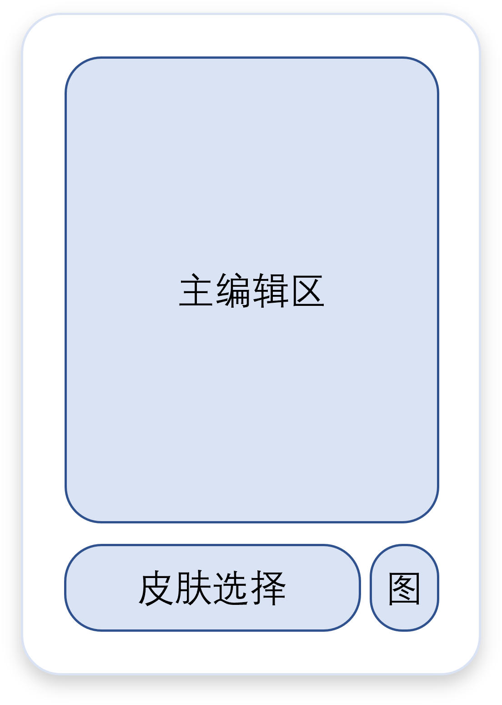
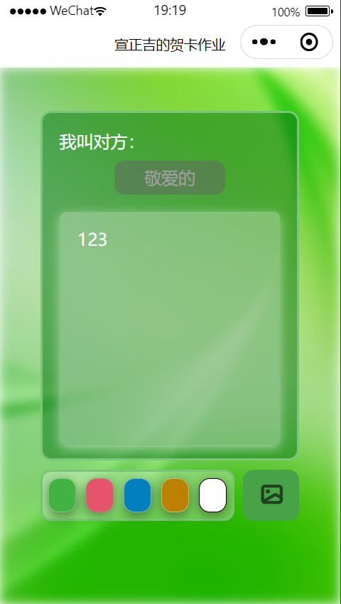
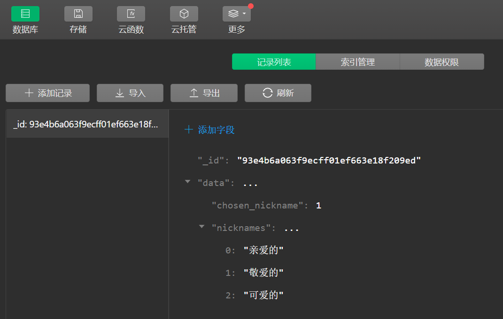
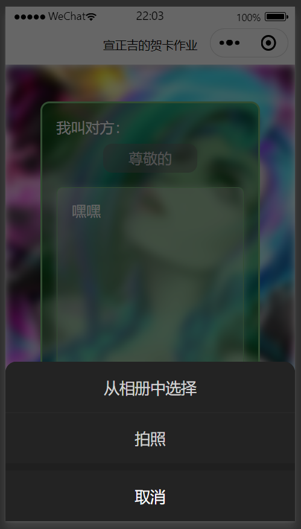
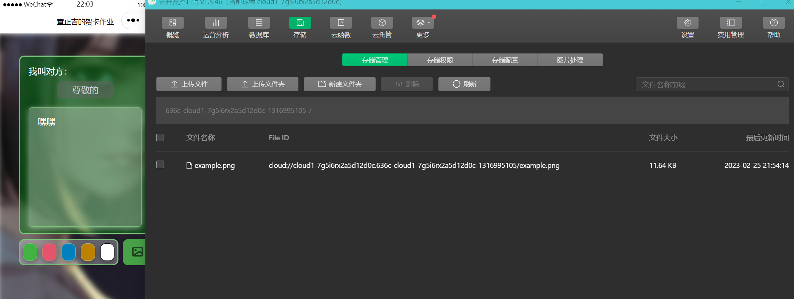
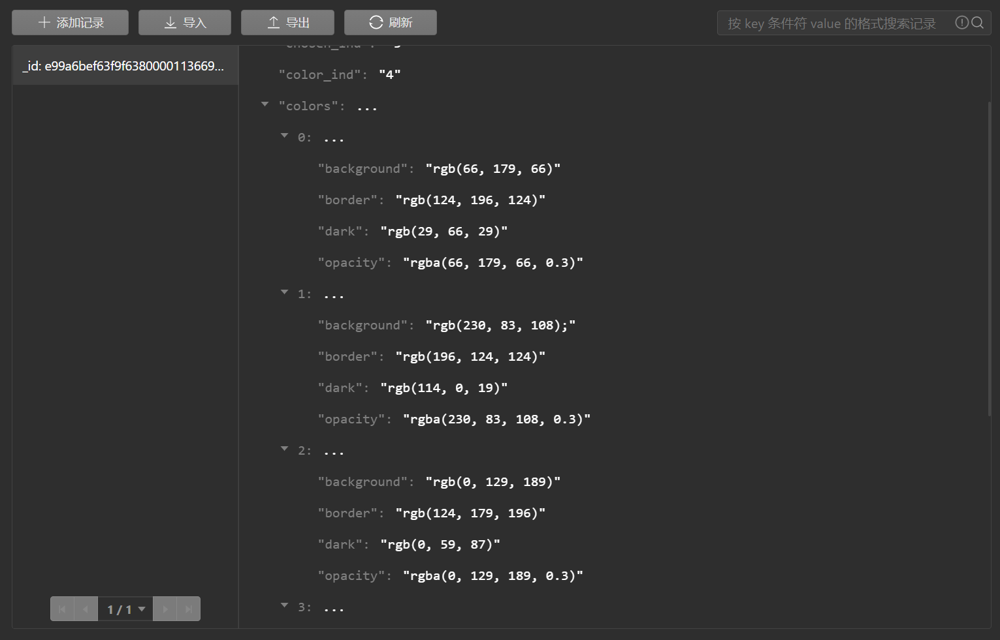
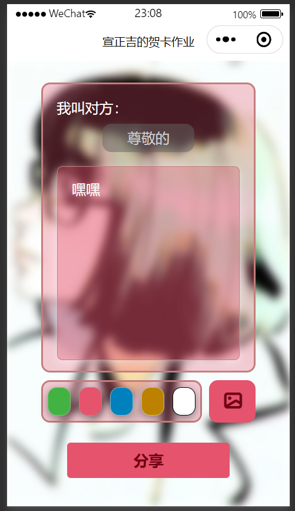
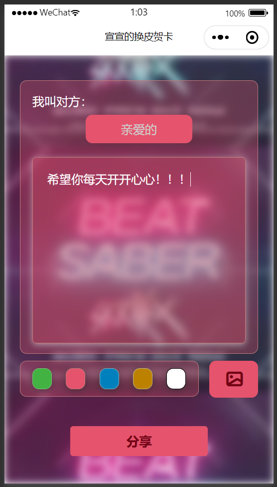
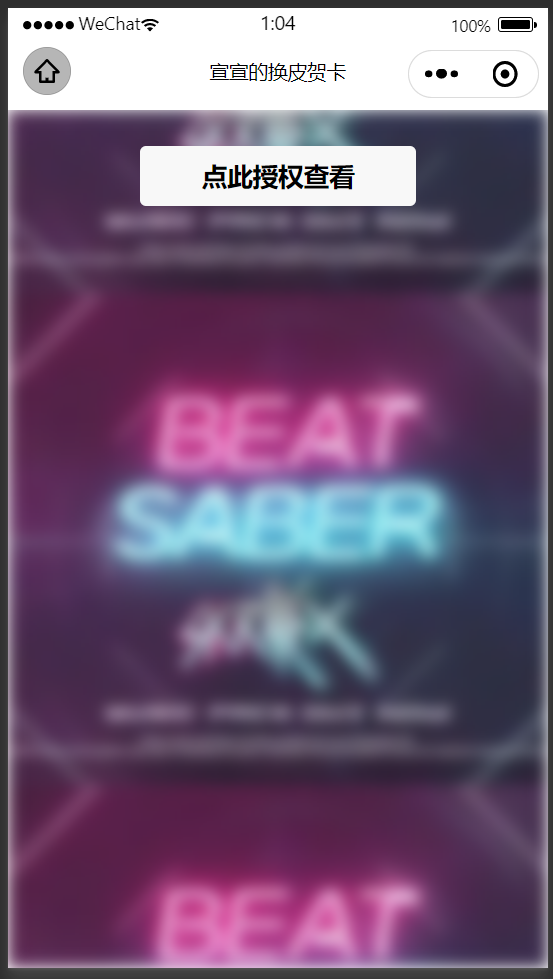
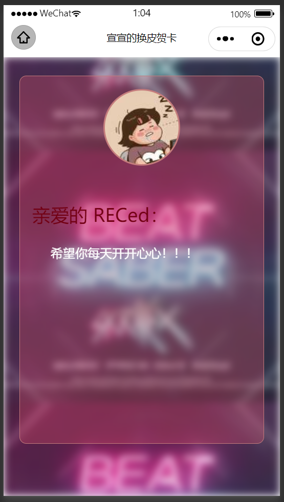

# <font color=deeppink>🎉 换皮贺卡</font>微信小程序<br><font size=3 color=grey>携程前端训练营&nbsp;&nbsp;&nbsp;&nbsp;HTML+CSS+JS 练习 </font><font size=3 color=grey>&nbsp;&nbsp;&nbsp;&nbsp;姓名：宣正吉 </font>

本项目已发布在GitHub，链接：
### 需求分析&知识点

##### 基础功能
1. 贺卡内容可编辑
2. 支持分享功能
3. 分享后显示不同分享页面的信息，并在主编辑区内显示当前用户的头像（路由、数据读写）

##### 拓展功能 😊😊😊
1. 可选择分享人称呼，分享后自动显示在页面上 🔈
2. 皮肤选择，预置几个主面板颜色选择（点击事件）🎇
3. 云存储数据，能够灵活调用（新功能的尝试）🌧
4. 自定义背景图（wx.chooseImage）🌅

---
### 编辑界面设计
  贺卡小程序界面比较简约，设计了一个贺卡编辑区域和贺卡，采用主区域半透明、背景模糊设计，较有现代感，下面是我所设计的界面示意图：
  <center>

</center>

- 先将背景随意设置一张图片，背景图水平居中，自动剪裁到中心，采用fliter:blur属性实现模糊效果
- 主编辑区的下划线部分使用input组件
- 输入内容部分采用textarea组件
- 皮肤选择设计为view内放置一些按钮
- 右侧一个按钮可以选择手机图片用于设置自定义背景图
- 昵称选择采用picker组件

编写出的静态界面如下：
<center>

</center>

---
### 云开发数据库
微信小程序开发有一个“云开发”功能，可以存储全局数据，这里我将数据存储到云服务中，需要时拿来用，可以保证全局的数据统一，根据文档的描述可知，数据的获取可以采用SetData的形式与本地同步。
<center>

</center>
下面是数据读取在onLoad函数上的测试：

```javascript
onLoad: function(){
    // 初始化云存储
    wx.cloud.init();
    // 获取云数据
    let that = this;
    const todo = db.collection('card_info').doc('e99a6bef63f9f638000011366999e245');
    todo.get({
      success: function(res){
        that.setData(res.data);
      }
    }
    )
  }
```
---
### 界面文本获取
需要从选择框和文字输入框内获取对应文字，并将其同步到全局数据内，同步后更新云数据，选择框和文本区域可以采用同一个函数更新数据和同步云数据，这里其实还可以优化，比如说在分享时才会更新云数据，否则可能占用带宽：
```javascript
setGlobalData: function(changed){
    // 获取云数据库
    const db = wx.cloud.database();
    let that = this;
    const todo = db.collection('card_info').doc('e99a6bef63f9f638000011366999e245');
    todo.update({data: changed});
  },
  // 更改称呼函数
  pick:function(e){
    let that = this;
    // console.log("触发选择事件")
    that.setData({
      chosen_ind: e.detail.value,
    });
    that.setGlobalData({chosen_ind: e.detail.value,});
  },
  // 更改文本内容
  changeWrites: function(e){
    let that = this;
    // console.log("触发文本更改事件", e)
    that.setData({
      text_content: e.detail.value,
    });
    that.setGlobalData({text_content: e.detail.value,});
  },
```
### 自定义背景图
点击更换背景图按钮即可，采用文档中介绍的`wx.chooseMedia`函数进行API接口的获取。同样，设置的自定义背景图需要传入到云端存储才能下载到本地，需要注意的是，在小程序刚刚加载完成时需要下载云图像并设置为背景图，统一命名为示例中的`example.png`，否则找不到源文件就没有背景图了：
<center>

</center>
<center>

</center>
<font color="orange">【这部分我做的还是挺复杂的，不知道有没有更好的方法😅，而且改了背景之后发现我做的颜色特别土……】</font>

下面是加载完成后的代码`onLoad`函数的修改，加入了背景图从云存储调用的功能：

```javascript
onLoad: function () {
    // 获取云数据库
    const db = wx.cloud.database();
    let that = this;
    const todo = db.collection('card_info').doc('e99a6bef63f9f638000011366999e245');
    todo.get({
      success: function (res) {
        that.setData(res.data);
      }
    })
    // 获取云图像作为背景图
    wx.cloud.downloadFile({
      fileID: 'cloud://cloud1-7g5i6rx2a5d12d0c.636c-cloud1-7g5i6rx2a5d12d0c-1316995105/example.png', // 文件 ID
      success: res => {
        // 返回临时文件路径并设置到本地
        console.log(res.tempFilePath)
        this.setData({file_path:res.tempFilePath})
      },
      fail: console.error
    })
  },
```

下面是点击更换背景图按钮的逻辑：

```javascript
// 选择背景图
  changeBack: function () {
    let that = this;
    // 显示选择列表，拍照还是从相册中选择
    wx.showActionSheet({
      itemList: ['从相册中选择', '拍照'],
      itemColor: "#00ff20",
      success: function (res) {
        if (!res.cancel) {
          if (res.tapIndex == 0) {
            that.chooseWxImage('album');
          } else if (res.tapIndex == 1) {
            that.chooseWxImage('camera');
          }
        }
      }
    })
  },
  // 根据所选类型进行操作
  chooseWxImage: function (type) {
    let that = this;
    // 选择图片加入缓存
    wx.chooseMedia({
      count: 9,
      mediaType: ['image','video'],
      sourceType: [type],
      maxDuration: 30,
      camera: 'back',
      success(res) {
        // 设置该临时路径到data和传到云端
        console.log(res.tempFiles[0].tempFilePath);
        that.setData({file_path: res.tempFiles[0].tempFilePath})
        that.setGlobalData({file_path: res.tempFiles[0].tempFilePath});
        // 上传该文件
        wx.cloud.uploadFile({
          cloudPath: 'example.png', // 上传至云端的路径
          filePath: res.tempFiles[0].tempFilePath, // 小程序临时文件路径
          success: res => {
            // 返回文件 ID
            console.log(res.fileID)
          },
          fail: console.error
        })
      }
    })
  }
```
### 皮肤选择
这个部分也比较麻烦，我将所有配色信息也存储在云数据中，通过配色产生行内样式，点击各种颜色的按钮能够产生不同的index，配色信息以列表形式数据结构存储在云中，加载时可自动调用相关数据：

```javascript
// 更改皮肤配色
  chooseColor: function(e){
    let that = this;
    // console.log(e.target.id);
    let color = e.target.id;
    // 设置数据和云端数据
    that.setData({
      color_ind: color,
    });
    that.setGlobalData({
      color_ind: color,
    });
  },
```
这里展示以下设计的颜色数据：
<center>

</center>

---
### 分享功能和接收界面
【我好像忘记做分享按钮了😅】
分享按钮已经添加在程序下方，也能根据皮肤的选择而更改颜色，下面是效果展示：
<center>

</center>
我直接将原来的页面复制了一份，在上面改动，需要调整app.json来添加页面，否则路由不生效。
下面是调整好的页面，其中上半部分是头像显示区域，获取当前分享到用户的头像，下面祝福部分是用户的昵称，最后写好的效果如下：
<center>

</center>

<center>

</center>

<center>

</center>

---
### 遇到的重要问题
- 我发现真机调试的时候大小无法自适应，经过查阅资料需要调整css的单位为rpx！
- 获取用户信息的函数竟然还要授权？！所以在分享页面添加了一个判断条件，授权成功后函数才能返回用户信息，为了安全起见~
- 在获取用户头像时，由于获取的过程是异步的，图像还没加载出来就渲染了发生错误无法显示，可能是image标签也加载有误，采用view标签就可以